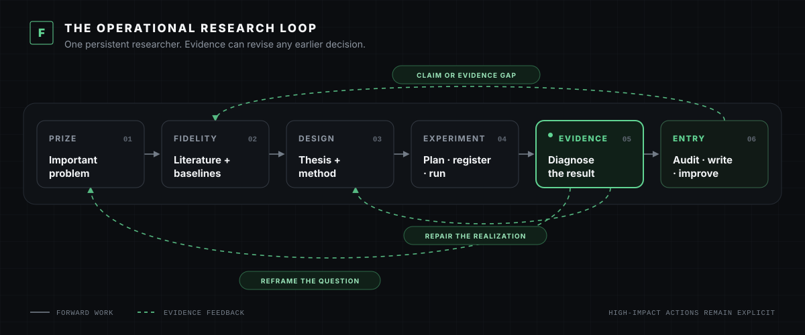

<p align="center">
  <strong>FIRM</strong><br>
  <sub><strong>F</strong>ailure-<strong>I</strong>nformed <strong>R</strong>esearch for <strong>M</strong>achines</sub>
</p>

<h1 align="center">Field-tested, end-to-end CS research skills for AI agents.</h1>

<p align="center">
  Seventeen skills for problem discovery, method formation, experiments,<br>
  independent second-PI review, and evidence-grounded paper writing.
</p>

<p align="center">
  <a href="#install-in-30-seconds"><strong>Install</strong></a> ·
  <a href="#see-the-difference"><strong>See the difference</strong></a> ·
  <a href="#development-timeline"><strong>Development timeline</strong></a> ·
  <a href="#design-and-documentation"><strong>Documentation</strong></a> ·
  <a href="README.zh-CN.md"><strong>简体中文</strong></a>
</p>

<p align="center">
  
  
  
  <a href="LICENSE"></a>
</p>

---

## Why FIRM

**FIRM** stands for **Failure-Informed Research for Machines**.

AI agents are good at producing motion: searches, code, experiments, plots, and
drafts. The harder problem is research judgment. FIRM helps an agent decide what
is worth studying, what a result actually means, what to build next, and when the
evidence has earned a paper.

One persistent `research` skill owns that scientific through-line across
literature, code, experiments, interpretation, method evolution, and paper
decisions. Sixteen specialists enter only when their capability is useful.

End-to-end does not mean silent autonomous spending or a rigid sequence of gates.
High-impact actions remain explicit, and completed evidence can send the project
back to the problem, baseline, or method instead of forcing it toward a paper.

## See the difference

<p align="center">
  
</p>

The same failed method result can produce a field-closure decision without FIRM
and a constructive design diagnosis with FIRM. The example uses the runnable
[`demo/fixture`](demo/fixture): one competent negative run diagnoses the current
realization. It does not justify killing the field, and it does not justify a seed
sweep. FIRM preserves the valid evidence and chooses the next experiment that can
change the design.

```bash
make demo
```

The command plays a guided terminal storyboard, not a prerecorded model
evaluation. To run the neutral case with Claude Code:

```bash
cd demo/fixture
claude
# then invoke: /firm:diagnose-result RESULT.md
```

## Contents

- [Why FIRM](#why-firm)
- [See the difference](#see-the-difference)
- [How it works](#how-it-works)
- [Install in 30 seconds](#install-in-30-seconds)
- [Start your own end-to-end project](#start-your-own-end-to-end-project)
- [What FIRM does](#what-firm-does)
- [Enter at any point](#enter-at-any-point)
- [What makes FIRM different](#what-makes-firm-different)
- [The 17 skills](#the-17-skills)
- [Development timeline](#development-timeline)
- [Repository map](#repository-map)
- [Design and documentation](#design-and-documentation)

## How it works

```text
Prize -> Fidelity -> Design -> Evidence -> Entry
  ^          evidence can revise any earlier decision          |
  +-------------------------------------------------------------+
```

- **Prize:** Would the best-case result matter to the community?
- **Fidelity:** Are the task, baseline, scorer, provenance, and costs real?
- **Design:** What load-bearing method primitive follows from the evidence?
- **Evidence:** What did the run diagnose, and what remains alive?
- **Entry:** Is the contribution mature enough for full paper writing?

A fresh Claude context is the default independent second PI at consequential
boundaries. Another model such as Codex may serve as an additional reviewer when
available. Each call has exactly one evidence-matched role: map the field and prize,
compare supplied explanations, challenge lead-PI constructions, or review a fixed
artifact. It is not a stop-button oracle or an always-on invention engine, and reviewer
unavailability does not pause the lead researcher's work.

### The operational research loop

<p align="center">
  
</p>

This is a living loop, not a mandatory stage machine. One researcher keeps the
original program, current paper, discovery slice, method lineage, scope debt,
active jobs, and next action coherent while the evidence changes.

## Install in 30 seconds

Inside Claude Code, add this repository as a plugin marketplace and install FIRM:

```text
/plugin marketplace add Zarien-Li/FIRM
/plugin install firm@firm-research
/reload-plugins
```

FIRM skills are then available under the `/firm:` namespace, so they do not
collide with skills from other plugins.

For a quick trial in the current repository:

```text
/firm:research "Own this project as a persistent first author. Preserve the important problem, establish credible baselines, build and test methods, interpret every result, and write only when the evidence is ready."
```

`research` is the persistent owner, not a macro that blindly runs all 17 skills.
It reads the current project state, chooses one highest-value next action, and
brings in a specialist only when the live uncertainty requires it.

## Start your own end-to-end project

For a serious long-running project, use the project-local setup so the research
program, first-message prompts, and skills travel with the repository.

### 1. Clone FIRM once

```bash
git clone https://github.com/Zarien-Li/FIRM.git ~/FIRM
```

### 2. Initialize the research repository

```bash
mkdir my-research-project
cd my-research-project
~/FIRM/firm init .
~/FIRM/firm doctor .
```

The initializer preserves an existing `CLAUDE.md` and creates:

```text
my-research-project/
├── CLAUDE.md
├── .claude/skills/            # 17 project-local FIRM skills
└── .firm/
    ├── RESEARCH_PROGRAM.md
    ├── FIRST_MESSAGE_NEW.md
    └── FIRST_MESSAGE_AUDIT.md
```

### 3. Define the research-program seed

Fill in [`.firm/RESEARCH_PROGRAM.md`](templates/RESEARCH_PROGRAM.md) at the level
of the important field and value surface:

- the outcome that would matter and who would change a decision;
- accepted benchmarks, real workflows, SOTA, and strong baselines;
- value, side-effect, cost, and safety metrics;
- compute, model, data, and time constraints;
- what the available surface can and cannot establish.

Do not preselect the final failure or method. The seed opens a consequential
research program; evidence determines the concrete problem and design.

### 4. Start the first-author session

```bash
claude --append-system-prompt-file ~/FIRM/CLAUDE-RESEARCH.md
```

For a new program, use [`.firm/FIRST_MESSAGE_NEW.md`](templates/FIRST_MESSAGE_NEW.md)
or invoke:

```text
/research "Start from .firm/RESEARCH_PROGRAM.md, establish the strongest empirical contact point, and execute the highest-value reversible next action."
```

For an existing project, use
[`.firm/FIRST_MESSAGE_AUDIT.md`](templates/FIRST_MESSAGE_AUDIT.md) to reconstruct
the original program, evidence, method lineage, scope debt, active jobs, paper
maturity, and one next action before launching more work.

You can print either prompt at any time:

```bash
~/FIRM/firm prompt new
~/FIRM/firm prompt audit
```

### 5. Continue through evidence

The lead researcher advances literature, baselines, method construction,
experiments, diagnosis, and paper decisions while keeping one compact project
state. Side-effectful workflows still require deliberate invocation, so FIRM will
not silently spend compute, inspect remote jobs, or rewrite a manuscript.

## What FIRM does

| Discover | Build | Finish |
|---|---|---|
| Reproduce strong baselines and inspect natural successes, failures, and contradictions | Turn negative results into a constructive method lineage instead of premature closure or random seed expansion | Use an independent second PI to audit prize, fidelity, evidence, scope, and paper readiness |
| Keep the original research program and community value visible as the project evolves | Distinguish implementation, design, optimization, statistical, and transfer uncertainty | Align the final claim with controls, costs, limitations, citations, and raw artifacts |

One persistent researcher owns the program. Specialist skills are tools loaded
when their capability is needed, not a rigid stage machine.

## Enter at any point

FIRM can start with a new direction, an existing repository, a completed result,
an active experiment, or a draft:

| Current situation | Direct entry |
|---|---|
| Choose a consequential field and empirical surface | `/firm:discover-direction [field or constraints]` |
| Start or resume a complete research program | `/firm:research [goal or project state]` |
| Establish a field-standard empirical anchor | `/firm:baseline [task or benchmark]` |
| Interpret a negative, mixed, or surprising result | `/firm:diagnose-result [result path]` |
| Invent or repair the method primitive | `/firm:design-method [evidence or failed component]` |
| Choose a decisive experiment campaign | `/firm:plan-experiments [method, claim, budget]` |
| Launch a registered experiment | `/firm:register-experiment` then `/firm:run-experiment` |
| Challenge a consequential decision independently | `/firm:second-pi [decision or evidence]` |
| Audit paper readiness and produce the manuscript | `/firm:audit-research` then `/firm:write-paper [paper directory]` |

Most judgment skills may activate when relevant. Seven high-impact skills are
**explicit-only**: `run-experiment`, `monitor-experiment`, `write-paper`,
`improve-paper`, `make-figures`, `audit-experiment`, and `audit-citations`.
Claude will not silently spend compute, inspect a remote system, rewrite a
manuscript, or run an artifact-level submission audit just because a description
matches.

## What makes FIRM different

| Research failure | FIRM response |
|---|---|
| Method v1 loses, so the agent kills the whole direction | Diagnose at the right level: run, realization, primitive, or family |
| A negative result triggers a large seed sweep | Separate design uncertainty from statistical uncertainty |
| A clean private slice becomes the “paper” | Track the original program, current paper, and accumulated scope debt separately |
| Failed methods are retrofitted into an analysis story | Require an independently valuable positive object and honest paper entry |
| Every result produces another menu of ideas | Choose one next action by expected information and research value |
| A polished draft starts steering the science | Rebuild claims from raw evidence, matched baselines, and explicit scope |

FIRM is not a rigid stage machine. One persistent researcher owns the program;
specialist skills enter only when their capability is useful.

### Three ideas at the core

**Failure hierarchy.** A competent negative run can reject the current
realization without rejecting the primitive, family, or research program.

**Constructive method lineage.** Each method version records its causal bet, what
activated, what failed, what survives, and what the next version must change.

**Paper/program separation.** The broad research program, current paper claim,
discovery slice, and scope debt remain separate objects. A narrow result cannot
borrow importance from a broad field name.

## The 17 skills

| Discover & anchor | Diagnose & design | Run & verify | Write & finish |
|---|---|---|---|
| [`research`](skills/research/SKILL.md) | [`diagnose-result`](skills/diagnose-result/SKILL.md) | [`register-experiment`](skills/register-experiment/SKILL.md) | [`write-paper`](skills/write-paper/SKILL.md) |
| [`discover-direction`](skills/discover-direction/SKILL.md) | [`design-method`](skills/design-method/SKILL.md) | [`run-experiment`](skills/run-experiment/SKILL.md) | [`improve-paper`](skills/improve-paper/SKILL.md) |
| [`literature-review`](skills/literature-review/SKILL.md) | [`plan-experiments`](skills/plan-experiments/SKILL.md) | [`monitor-experiment`](skills/monitor-experiment/SKILL.md) | [`audit-citations`](skills/audit-citations/SKILL.md) |
| [`baseline`](skills/baseline/SKILL.md) | [`second-pi`](skills/second-pi/SKILL.md) | [`audit-experiment`](skills/audit-experiment/SKILL.md) | [`make-figures`](skills/make-figures/SKILL.md) |
|  |  | [`audit-research`](skills/audit-research/SKILL.md) |  |

See the [skills index](skills/INDEX.md) for trigger boundaries, arguments, and
recommended combinations.

## Development timeline

FIRM was not written once and published as a prompt pack. Each major revision
followed a recurring failure observed in live research.

| Time | What happened | Product change |
|---|---|---|
| 2025 Q1 | Long-running agents could execute work but repeatedly returned ordinary research decisions to the user | FIRM began as an attempt to give AI agents persistent first-author ownership |
| 2025 Q2 | Session continuity preserved files but not the reason a research direction mattered | Added a durable research program, value spine, contrary evidence, and one chosen next action |
| 2025 H2 | ARIS demonstrated useful foundations for persistent execution, portable skills, and multi-agent review | Adopted selected execution ideas, then began rebuilding the research-decision layer through field use |
| 2026 Q1 | One failed realization closed whole method families, while broken designs triggered wasteful seed expansion | Separated run, realization, primitive, and family failure; made constructive redesign the default |
| 2026 Q2 | Broad programs shrank into private cells, and failed methods were repackaged as analysis papers | Added scope debt, standard-task reintegration, positive-object tests, and independent paper entry |
| 2026-06 | Three human-verified papers developed under successive versions entered external review | Nine official ACL ARR reviews returned mean overall assessments of 3.50, 3.33, and 3.17 |
| 2026-07-27 | More than 100B model tokens across five model families exposed repeated agent failure modes and overlapping workflow rules | Consolidated the system into one persistent researcher and 17 focused skills |

Only aggregate review scores are public to protect active double-blind work. They
are not acceptance decisions or a controlled estimate of FIRM's causal effect.
Every counted paper was read, checked, and approved by human authors before
submission.

## Repository map

```text
FIRM/
├── .claude-plugin/   # Claude Code plugin and marketplace manifests
├── skills/           # 17 callable research skills and scoped references
├── templates/        # optional project-local research bootstrap
├── examples/         # sanitized research-agent failure cases
├── demo/             # neutral result-diagnosis fixture and demo script
├── docs/             # architecture, failure map, onboarding, and release docs
├── scripts/          # validation, onboarding, and release checks
├── assets/           # README and social-preview sources
├── firm              # project-local init, doctor, list, and prompt helper
└── install.sh        # direct global or project-local skill installer
```

Each public capability lives in `skills/<name>/SKILL.md`. Detailed procedures and
schemas stay beside the owning skill in `references/` so runtime context remains
scoped.

## Design and documentation

- [Getting started](docs/getting-started.md)
- [Skills index and trigger boundaries](skills/INDEX.md)
- [Failure map](docs/failure-map.md)
- [Three sanitized cases](examples/README.md)
- [Origin and design history](docs/origin-and-design.md)
- [Agent and maintainer guide](docs/agent-guide.md)

## Contributing

The best contribution is not another generic prompt. It is a recurring research-agent
failure, a minimal repair to a skill, and a case showing that the repair does not
create an equal and opposite mistake. See [CONTRIBUTING.md](CONTRIBUTING.md).

FIRM is independent and unofficial. It is not maintained or endorsed by Anthropic,
OpenAI, ACL, ARR, or ARIS. Selected workflow ideas were adapted from ARIS under the
MIT License; see [NOTICE](NOTICE) and [origin and design](docs/origin-and-design.md).

## License

MIT. Researchers remain responsible for novelty, data, compute, authorship,
citations, disclosure, claims, and submission decisions.

<p align="center">
  <strong>A failed method is evidence—not a verdict on the field.</strong>
</p>
