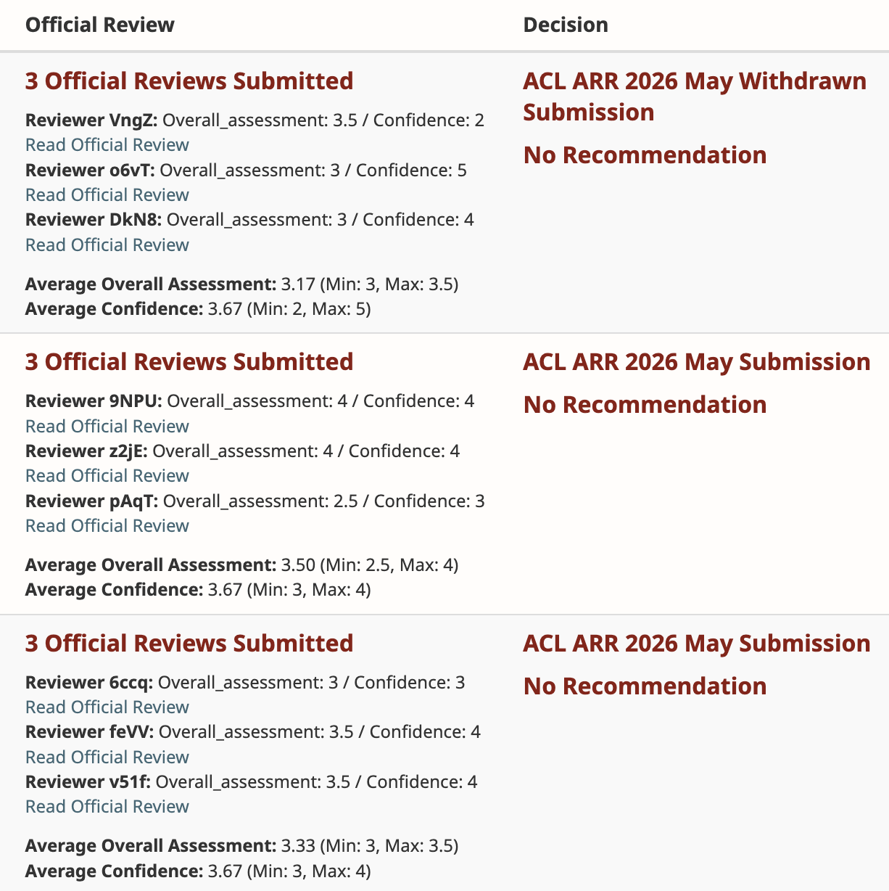

<h1 align="center">ResearcherOS</h1>

<p align="center">
  <strong>100B+ tokens of real research, distilled into a map of where AI loses research judgment and the skills that bring it back.</strong>
</p>

<p align="center">
  <a href="https://github.com/wanshuiyin/Auto-claude-code-research-in-sleep"></a>
  
  
  
</p>

> Most autonomous-research systems optimize the loop.  
> **ResearcherOS optimizes the researcher that must survive many loops.**

The meaning of **100B+ tokens** is not that an AI kept working for a long time. It is that we now
know where research agents repeatedly stumble, become trapped in narrow lines of thought, confuse
activity with progress, and silently turn an important research program into an unimportant
paper.

**You are not downloading 17 Markdown files. You are inheriting a failure map paid for by
100B+ tokens of real research.**

The first idea fails. A simple baseline wins. A promising mechanism disappears under a matched
control. The project drifts from an important field into a tiny private problem. Ten experiments
produce more files but no method. A draft looks mature until an independent reviewer finds that
the evidence does not support its central claim.

That is where autonomous research usually breaks.

ResearcherOS is a curated suite of agent skills for what happens next: preserving ownership,
research value, scientific judgment, method lineage, evidence integrity, and the ability to
recognize when an honest paper is ready.

| Built from | What it means |
|---|---|
| **Since 2025** | Began as an exploration of whether long-horizon auto-research could become a company |
| **100B+ model tokens** | Rewritten through live research programs, not a handful of demonstrations |
| **Three ARR-reviewed submissions** | Work developed under successive workflow versions received mean official-review scores of **3.50, 3.33, and 3.17** |
| **ARIS lineage** | Selected foundations were adapted from ARIS; the current system is an independent, unofficial field evolution |

> **Star ResearcherOS if you would rather inherit these lessons than pay to rediscover them.**

## From A Startup Thesis To Open Source

This project started in 2025 with a startup question:

> Can an AI agent do more than generate research-shaped output? Can it remain a competent
> first author across weeks of uncertainty, failed methods, expensive experiments, and changing
> evidence?

During that journey, [ARIS: Auto-Research-In-Sleep](https://github.com/wanshuiyin/Auto-claude-code-research-in-sleep)
became an important part of the foundation. ARIS demonstrated the power of portable Markdown
skills, end-to-end research workflows, persistent artifacts, and adversarial cross-model review.
We adopted and adapted selected ideas from that foundation.

Then live research kept breaking the workflow.

Agents abandoned methods after one failed realization, but wasted seeds after a decisive negative
result. They found real phenomena and then narrowed them until almost nobody would care. They used
probes as a substitute for design, treated a reviewer as a stopping authority, converted failed
method lineages into weak analysis papers, and delayed evidence audits until the draft was nearly
finished. Fixing one failure sometimes created its opposite.

So the system was repeatedly rewritten. Rules that sounded sensible but harmed research were
deleted. Specialist skills were consolidated. Fixed state machines gave way to one persistent
researcher identity. Cross-model review moved from late-stage judgment to early co-PI reasoning.
The result is not a snapshot of ARIS and not a prompt pack with more checklists. It is the
research judgment accumulated after taking skill-based auto-research into a much longer and
messier operating regime.

We originally considered keeping that accumulated judgment proprietary. We are open-sourcing it
because the most useful part is not a hidden platform. It is the inspectable record of what agents
repeatedly get wrong, and the compact set of instructions that helped them recover.

## The Failure Map Behind 100B+ Tokens

The token count is not a benchmark and it is not the product. It is the stress test that exposed
a repeatable failure surface for long-horizon AI research.

Every major instruction in this repository should answer a real failure:

- **Seed drift:** Is the current paper still solving the important program we started with?
- **Premature closure:** Did a method family fail, or did one implementation fail?
- **Wasteful persistence:** Is uncertainty statistical, or has one competent run already exposed
  a design error?
- **Probe addiction:** What design decision changes because of this analysis?
- **Baseline avoidance:** Does the strongest matched incumbent actually close the observed
  failure?
- **Analysis fallback:** Would the analysis contribution exist if the failed method history were
  deleted?
- **Late integrity failure:** Are provenance, scoring, padding, convergence, cost, and matched
  controls correct before the paper identity hardens?
- **Endless research:** Is the next experiment necessary for the bounded claim, or are we failing
  to harvest a mature contribution?

These are not hypothetical prompt-design concerns. They recurred across live projects often
enough to reveal stable confusions in agent behavior. Read the
[`FAILURE_MAP.md`](FAILURE_MAP.md) for the symptoms, underlying confusions, scientific costs, and
the skill responses developed from them.

The suite is evolved by the same rule it gives the researcher: interpret the evidence, repair the
causal failure, and remove obsolete structure instead of endlessly adding patches.

## What ResearcherOS Changes

### One persistent first author

`research-pipeline` owns the program from first field contact to paper maturity. It keeps the
original program, current paper candidate, value spine, method lineage, evidence, scope debt, next
action, and maturity judgment visible at the same time.

The other skills are tools used by that researcher. They are not permission gates and they do not
form a mandatory stage machine.

### Problems are earned through empirical contact

The process begins with a field, serious benchmark or system surface, community value, and
resource boundary. It reproduces credible systems and inspects successes, failures, and
contradictions before locking a narrow problem.

Synthetic slices, oracle interventions, and probes can reveal mechanisms. They cannot replace
evidence that a natural problem matters.

### Methods are formed through constructive ablation

A first prototype is not judged as if it were a finished method. Components are added, removed,
replaced, frozen, rerouted, or factorized so that each result teaches the next design.

ResearcherOS distinguishes:

- a failed run;
- an immature realization;
- a primitive whose mechanism did not activate;
- a contradicted method family;
- and the broader research program.

Those are different scientific conclusions.

### Design uncertainty is not statistical uncertainty

When one competent seed shows a large, mechanistically meaningful failure, the next action is
diagnosis or redesign, not a ceremonial seed sweep. More seeds are used when they answer a
defined stochastic question or support a paper-level reliability claim.

### Goals measure scientific motion, not narrative success

Long-running agents receive bounded evidence cycles:
`interpret -> construct or repair -> run/read a representative test -> update state`.
The cycle may finish with a positive result, a diagnosed directional loss, or a paper-identity
reset. It cannot finish merely because the agent wrote more prose, launched more seeds, or found
a new claim to protect.

### The reviewer is a second PI

`research-review` asks an independent model to reason through:

`Prize / Fidelity / Entry -> Interpret -> Invent -> Attack -> Assess Maturity -> Decide`

The reviewer is brought in before expensive commitments, not only when the paper needs a score.
It challenges whether the best-case result matters, whether the project still honors its seed,
which hidden variable explains the evidence, what stronger method follows, and whether the
current contribution is already worth harvesting.

### Finishing is part of research

The system resists both premature writing and endless expansion. A stable correlation is not
automatically a paper, but a mature positive object should not be held hostage by every possible
future experiment.

The durable research program and the current paper are tracked separately. A change in
contribution type, positive object, primitive, population, primary metric, or decisive baseline
creates a new paper identity; evidence transfers, but manuscript maturity does not.

Complete manuscript writing begins only after a raw-evidence packet receives independent
`PRIZE`, `FIDELITY`, and `ENTRY` review and records `PAPER_ENTRY.md: PASS`. Before that, the
researcher keeps a compact `CANDIDATE_CLAIM.md`. If a decisive baseline wins, seed provenance
breaks, a fair control reverses the claim, or the method exists only in prose, the manuscript
circuit breaker freezes polishing while the broader program continues.

## Relationship To ARIS

ResearcherOS is an **independent and unofficial project**. It is neither maintained nor endorsed
by the ARIS authors.

Its lineage is explicit:

| Foundation informed by ARIS | Center of gravity after field evolution |
|---|---|
| Portable Markdown `SKILL.md` workflows | One persistent researcher with on-demand capabilities |
| Executor plus cross-model reviewer | Independent reviewer as early second PI, not a terminal judge |
| End-to-end research automation | Long-horizon ownership across repeated interpretation and redesign |
| Persistent research artifacts | Compact authoritative state, method lineage, scope debt, and paper maturity |
| Review and assurance workflows | Early evidence integrity plus claim-dependent harvest decisions |

The current public suite contains substantial original restructuring and many later generations
of research guidance, but its ARIS influence should be credited rather than hidden. ARIS is
released under the MIT License; upstream attribution is preserved in [`NOTICE`](NOTICE).

For the original project and technical report:

- [ARIS GitHub repository](https://github.com/wanshuiyin/Auto-claude-code-research-in-sleep)
- [ARIS: Autonomous Research via Adversarial Multi-Agent Collaboration](https://arxiv.org/abs/2605.03042)

## Evidence, Not A Promise

Three submissions developed under successive versions of this workflow received mean official
reviewer scores of **3.50**, **3.33**, and **3.17** in the ACL ARR 2026 May cycle.

These scores are external evidence that the workflow has supported research artifacts evaluated
by real reviewers. They are not an acceptance guarantee, a controlled causal estimate of the
skills, or a claim that every research program will succeed. At the time of the captured
dashboard, one submission had been withdrawn and none had received a recommendation.



<sub>Official-review dashboard evidence supplied by the project owner. Reviewer identifiers are
anonymous system codes; paper titles and author identities are not shown.</sub>

The more important evidence is developmental: the current rules preserve lessons from many
projects that did not work cleanly. Negative results are useful here only when they improve the
researcher, not when they are repackaged as success.

## 中文简介

**大多数 auto-research 项目优化的是一次闭环；ResearcherOS 优化的是能够穿越许多次失败闭环的研究者。**

这个项目始于 2025 年。最初我们在探索它能否成为一家 auto-research 创业公司的基础。后来，
[ARIS](https://github.com/wanshuiyin/Auto-claude-code-research-in-sleep) 提供了重要启发：
轻量 Markdown skills、端到端工作流、持久化研究产物和跨模型对抗评审。我们借鉴并改造了其中
一部分基础。

但真实研究远比一次 workflow 更混乱。Agent 会在一个 realization 失败后放弃整条方法路线，
却又在一个 seed 已经暴露设计错误后继续浪费大量算力；会从重要领域一路钻进只有本项目关心的
小 cell；会把 probe 当方法、把 Codex 当终止裁判、把失败的方法历史倒推成分析论文，并在论文
快写完时才发现 baseline、scorer 或 provenance 有问题。

我们在 **100B+ 模型 token** 的真实项目中反复修改这些 skills。修复不是不断增加 checklist：
当旧规则被证据推翻，就删除它；当多个工具重复，就合并它；当固定状态机压制研究判断，就让位给
一个持续承担第一作者/PI 责任的研究者人格。

这 100B+ token 的意义不是“AI 工作了很久”，而是我们已经知道 AI 会在科研的哪些地方跌跟头、
钻牛角尖、混淆忙碌与进展，并在不知不觉间把一个重要研究方向做成无人关心的小问题。你下载的
不只是 17 个 Markdown 文件，而是一张用 100B+ token 的真实研究代价换来的 failure map。

真正开源的是从这些长期成败中蒸馏出的研究判断。使用不同版本工作流形成的三个 ARR 投稿获得了
平均 **3.50 / 3.33 / 3.17** 的官方评审分数。截图时其中一个投稿已撤稿，三个投稿均未获得
recommendation；这些分数不是录用证明或因果效果估计。我们愿意公开这套系统如何在真实失败中
成长，也欢迎社区继续挑战和改进它。

## Included Skills

| Research job | Skills |
|---|---|
| Persistent ownership | `research-pipeline` |
| Direction and empirical contact | `frontier-direction-discovery`, `research-lit`, `baseline`, `signal-analysis` |
| Method formation | `method-primitive-synthesis` |
| Experiment design and execution | `experiment-plan`, `research-contract`, `run-experiment`, `monitor-experiment` |
| Independent review and integrity | `research-review`, `experiment-audit`, `research-state-audit` |
| Writing and submission | `paper-writing`, `paper-figure`, `citation-audit`, `auto-paper-improvement-loop` |

See [`skills/INDEX.md`](skills/INDEX.md) for the role of every skill and the shared reference
library.

## Quick Start

The suite is primarily tested with Claude Code's `SKILL.md` format:

```bash
git clone https://github.com/Zoiya-Li/ResearcherOS.git && cd ResearcherOS && bash install.sh
```

The installer backs up conflicting skill directories, installs the complete
suite, and verifies required files. Preview its actions with:

```bash
bash install.sh --dry-run
```

Install into a separate location with:

```bash
bash install.sh --target /path/to/skills
```

Restart Claude Code, or explicitly ask an existing session to reread the
updated skills. Existing sessions may retain old instructions in conversation
context after files change.

Start a project with:

```text
Use research-pipeline as the persistent researcher for this project.
The field is [FIELD], the accepted benchmark or system surface is [BENCHMARK/SYSTEM],
the value is [WHY THE COMMUNITY CARES], and the resource boundary is [BUDGET].
Reproduce credible anchors, inspect raw behavior, form the problem from evidence,
and autonomously pursue the highest-value method and paper path.
```

The Markdown workflows can be adapted to Codex and other agent runtimes. Claude-specific
frontmatter tool names should be mapped to equivalent tools in the target runtime.

## See It On Real Failure Patterns

ResearcherOS is easiest to understand at the point where an ordinary research
loop loses judgment:

1. [A method loses once](examples/01-method-loss-is-not-field-loss.md): diagnose
   and repair the realization instead of closing the field or sweeping seeds.
2. [The paper drifts from the seed](examples/02-seed-drift.md): expose scope
   debt and reconnect a private slice to standard value.
3. [A draft starts before the method is ready](examples/03-paper-entry-audit.md):
   apply evidence integrity and paper-entry review before polishing hardens the
   wrong claim.

The release includes a complete
[90-second demo script](demo/90-second-demo.md), a
[recording checklist](demo/recording-checklist.md), and a small
[Claude Code fixture](demo/fixture).

## Runtime

The conceptual skills require file access and the ability to run project tools. Specialist
capabilities are conditional:

- **Independent review:** Codex MCP was the primary development setup. Another genuinely
  independent model or fresh context can implement the protocol.
- **Literature and citations:** use authoritative proceedings, DBLP, Crossref, arXiv, ACL
  Anthology, or OpenReview.
- **Experiments:** use the project's local runtime, SSH host, Slurm cluster, or scheduler.
- **Papers:** a working LaTeX installation is required for compilation.
- **Figures and tracking:** use the project's plotting stack; W&B is optional.

No unpublished helper script is required by this public release.

## What This Suite Does Not Promise

- A paper, acceptance, or a particular reviewer score.
- A deterministic recipe for scientific discovery.
- That every crowded field contains a tractable opening.
- That independent review can replace researcher ownership.
- That more automation removes the need for domain expertise or human responsibility.

## Contributing

The most valuable contribution is not another plausible-sounding rule. It is a demonstrated
improvement:

1. identify a recurring failure or missed opportunity in real use;
2. show representative evidence;
3. locate the instruction that caused or failed to prevent it;
4. propose the smallest general repair;
5. test for new rigidity, lost creativity, or conflicting guidance;
6. remove or consolidate superseded instructions.

ResearcherOS should become wiser through iteration, not merely longer.

## License And Attribution

ResearcherOS is released under the MIT License. See [`LICENSE`](LICENSE).

Selected concepts and portions of the skill lineage were adapted from
[ARIS](https://github.com/wanshuiyin/Auto-claude-code-research-in-sleep), Copyright (c) 2026
wanshuiyin, also released under the MIT License. See [`NOTICE`](NOTICE) for provenance.
