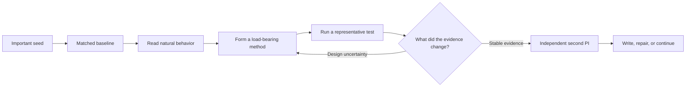

<p align="center">
  
</p>

<h1 align="center">FIRM</h1>

<p align="center">
  <strong>Failure-Informed Research for Machines</strong><br>
  The judgment layer for long-horizon AI research.
</p>

<p align="center">
  
  
  
  <a href="https://github.com/wanshuiyin/Auto-claude-code-research-in-sleep"></a>
</p>

<p align="center">
  <a href="#install"><strong>Install</strong></a>
  ·
  <a href="#three-real-failure-patterns"><strong>See the cases</strong></a>
  ·
  <a href="FAILURE_MAP.md"><strong>Open the failure map</strong></a>
  ·
  <a href="skills/INDEX.md"><strong>Browse the skills</strong></a>
</p>

---

Research agents can launch experiments. The harder problem is deciding what a
result means.

A method loses once. A simple baseline wins. A broad seed quietly becomes a
private benchmark cell. More runs create more files but no method. A polished
draft reaches independent review before anyone checks whether the scorer,
provenance, or decisive control is sound.

**FIRM is not another auto-research loop. It gives the machine the research
judgment needed to survive many loops.**

## Install

```bash
git clone https://github.com/Zoiya-Li/FIRM.git && cd FIRM && bash install.sh
```

The installer backs up conflicting skill directories, installs the full suite,
and verifies the result. It supports `--dry-run` and `--target /path/to/skills`.

## What Usually Breaks

| Research moment | Common agent reflex | FIRM response |
|---|---|---|
| The first method loses | Close the field, or sweep ceremonial seeds | Diagnose the realization, then repair the implicated component |
| A real pattern appears | Narrow until only the project cares about it | Track scope debt and reconnect to a standard task or system |
| A probe predicts failure | Promote the probe into the contribution | Require a design consequence and train the actual method |
| A deadline approaches | Turn experiment count into paper maturity | Audit prize, fidelity, evidence integrity, and paper entry first |

These are recurring behaviors observed across live projects, not hypothetical
prompt mistakes. The full [failure map](FAILURE_MAP.md) connects each symptom
to its hidden confusion, scientific cost, and repair.

## The Operating Model



One persistent `research-pipeline` owns the program. Specialist skills are
tools, not permission gates or a mandatory state machine.

FIRM keeps four distinctions visible:

| Distinction | Decision |
|---|---|
| Important program vs. current paper | Is the paper still solving something the field values? |
| Failed run vs. failed method family | What exactly did the evidence contradict? |
| Design uncertainty vs. statistical uncertainty | Redesign now, or replicate for reliability? |
| More understanding vs. enough contribution | Expand the program, or harvest an honest paper? |

## Three Real Failure Patterns

| Case | What goes wrong | Corrective move |
|---|---|---|
| [A method loses once](examples/01-method-loss-is-not-field-loss.md) | One realization is confused with the field, while extra seeds cannot repair design | Preserve the program and form the next constructive ablation |
| [The paper drifts from the seed](examples/02-seed-drift.md) | A rigorous private cell replaces the important problem | Expose scope debt and require a reintegration path |
| [Writing starts too early](examples/03-paper-entry-audit.md) | Experimental volume is mistaken for contribution maturity | Run evidence integrity and independent paper-entry review |

The cases are sanitized composites distilled from recurring behavior in real
research programs. They are decision patterns, not claims that one prompt
guarantees a paper.

## Built From Field Failure

| **100B+** | **17** | **3** |
|:---:|:---:|:---:|
| model tokens across live research | focused research skills | ARR-reviewed submissions |

The token count is not a benchmark. It is the stress test that exposed where
long-horizon research agents repeatedly lose judgment. Rules were revised,
merged, or deleted when experience showed that they created rigidity,
premature closure, seed theater, or endless research.

Three submissions developed under successive workflow versions received mean
official ACL ARR reviewer scores of **3.50**, **3.33**, and **3.17**. This is an
external signal, not an acceptance claim or a controlled estimate of FIRM's
causal effect.

<details>
<summary><strong>View the official-review evidence and exact limitations</strong></summary>

At the time of the captured ACL ARR 2026 May dashboard, one submission had
been withdrawn and none had received a recommendation.

<p align="center">
  
</p>

</details>

## Skill System

| Research responsibility | Skills |
|---|---|
| Own the program | `research-pipeline` |
| Establish empirical contact | `frontier-direction-discovery`, `research-lit`, `baseline`, `signal-analysis` |
| Form and test methods | `method-primitive-synthesis`, `experiment-plan`, `research-contract`, `run-experiment`, `monitor-experiment` |
| Review evidence and claims | `research-review`, `experiment-audit`, `research-state-audit`, `citation-audit` |
| Write and improve the paper | `paper-writing`, `paper-figure`, `auto-paper-improvement-loop` |

See [the complete skill index](skills/INDEX.md) for activation guidance and
shared references.

## Start A Research Program

```text
Use research-pipeline as the persistent researcher for this project.
The field is [FIELD], the accepted benchmark or system surface is [BENCHMARK/SYSTEM],
the value is [WHY THE COMMUNITY CARES], and the resource boundary is [BUDGET].
Reproduce credible anchors, inspect raw behavior, form the problem from evidence,
and autonomously pursue the highest-value method and paper path.
```

The suite is primarily tested with Claude Code's `SKILL.md` format. The
Markdown workflows can be adapted to Codex and other agent runtimes by mapping
tool names to their equivalents.

## Origin And Lineage

FIRM began in 2025 as an attempt to make auto-research persist through real
scientific uncertainty rather than merely complete a workflow. Selected
foundations were adapted from
[ARIS](https://github.com/wanshuiyin/Auto-claude-code-research-in-sleep),
including portable Markdown skills, persistent artifacts, and cross-model
review. Later versions were repeatedly restructured through live research.

FIRM is independent and unofficial. It is not maintained or endorsed by the
ARIS authors. Attribution is preserved in [NOTICE](NOTICE).

Read the [long-form origin, design rationale, evidence, and ARIS
relationship](docs/ORIGIN_AND_DESIGN.md).

<details>
<summary><strong>中文简介</strong></summary>

大多数 auto-research 项目优化的是一次实验闭环。FIRM
关注的是机器如何在许多轮失败、反常结果和方法重构中保持研究判断。

它不是保证论文产出的固定流程，而是一组经过长期真实研究反复修改的
skills：防止重要 seed 漂移成无人关心的小问题，区分设计失败与统计不确定性，
让 probe 服务于方法设计，在写作前完成证据审计，并在贡献成熟时及时收获。

</details>

## License

FIRM is released under the [MIT License](LICENSE). Selected lineage from ARIS
is credited in [NOTICE](NOTICE).

<p align="center">
  <strong>Inherit the failure map. Do not pay to rediscover it.</strong>
</p>
