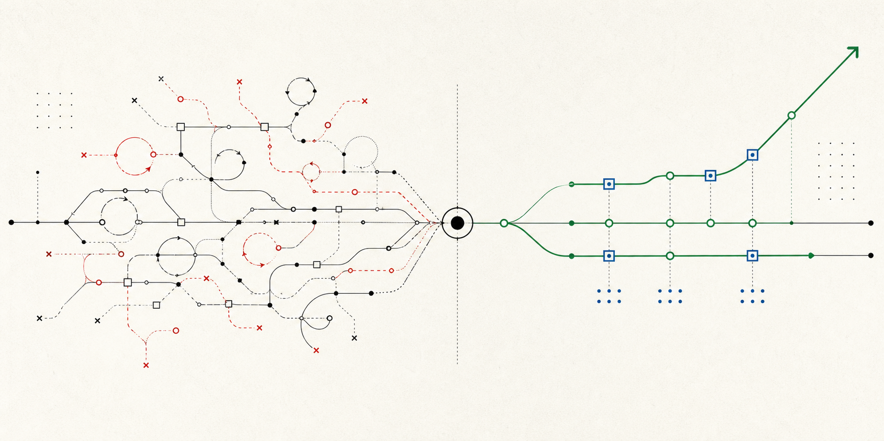
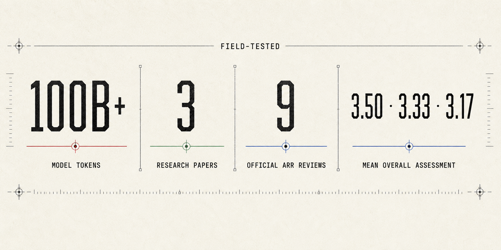
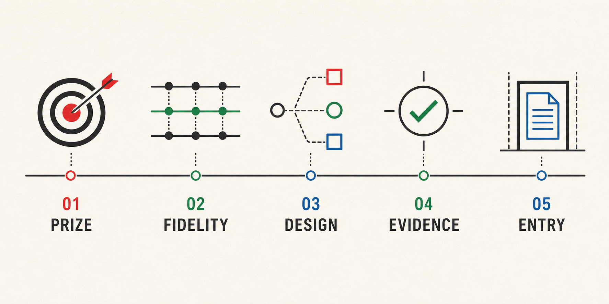

<p align="center">
  
</p>

<h1 align="center">FIRM</h1>

<p align="center">
  <strong>The PI layer your research agent is missing.</strong><br>
  Your agent can run experiments. FIRM stops it from confidently researching the wrong thing.
</p>

<p align="center">
  
  
  
  <a href="https://github.com/wanshuiyin/Auto-claude-code-research-in-sleep"></a>
</p>

<p align="center">
  <a href="#install"><strong>Install</strong></a>
  ·
  <a href="#three-real-failure-patterns"><strong>See the cases</strong></a>
  ·
  <a href="FAILURE_MAP.md"><strong>Open the failure map</strong></a>
  ·
  <a href="skills/INDEX.md"><strong>Browse the skills</strong></a>
</p>

<p align="center">
  
</p>

<p align="center">
  <strong>Not a weekend prompt pack.</strong> FIRM was repeatedly rebuilt inside
  long-running research programs, then tested against the mistakes those programs actually made.
</p>

---

Most auto-research systems reward motion: more searches, more jobs, more files,
more prose. They do not reliably notice when the research itself has gone wrong.

FIRM installs the missing PI layer. It keeps the important seed visible,
forces failures to change the next design, brings in an independent model
before expensive commitments, and prevents a plausible narrative from becoming
a paper before the evidence is ready.

> **Installation takes one command. Recovering from a month of seed drift does not.**

If your agent only writes code, you do not need FIRM. If it decides **what to
test, what a failure means, and when a paper exists**, you do.

## Install

```bash
git clone https://github.com/Zoiya-Li/FIRM.git && cd FIRM && bash install.sh
```

The installer backs up conflicting skill directories, installs the full suite,
and verifies the result. It supports `--dry-run` and `--target /path/to/skills`.

## The Failures That Consume Weeks

| Pattern | Without FIRM | With FIRM |
|---|---|---|
| **Baseline shock** | A stronger baseline arrives late and resets the paper | Reproduce matched incumbents before the claim hardens |
| **Method panic** | One loss closes the family, or triggers a meaningless seed sweep | Separate design failure from statistical uncertainty and construct the next version |
| **Seed drift** | An important field becomes a clean result in a private cell | Track scope debt and require a path back to standard value |
| **Probe addiction** | Predicting the failure is mistaken for fixing it | Require every probe to change a method decision |
| **Paper theater** | Files and plots are counted as maturity | Audit raw evidence, contribution prize, and paper entry before full drafting |

These are recurring behaviors observed across live projects, not hypothetical
prompt mistakes. The full [failure map](FAILURE_MAP.md) connects each symptom
to its hidden confusion, scientific cost, and repair.

FIRM is cheapest before the wrong experiment, not after the wrong paper.

## Five Decisions Before Another Week Of Compute

<p align="center">
  
</p>

| Checkpoint | The question FIRM forces | What changes |
|---|---|---|
| **01 · PRIZE** | If everything works, will the community care? | Low-value private cells cannot borrow importance from the original seed |
| **02 · FIDELITY** | Is the current paper still solving the program we started? | Qualifiers become visible scope debt with an explicit repayment path |
| **03 · DESIGN** | Did the run fail, the realization fail, or the primitive fail? | The next experiment repairs a causal component instead of decorating v1 |
| **04 · EVIDENCE** | Do raw artifacts support the story under matched controls? | An independent second PI interprets, invents, and attacks before commitment |
| **05 · ENTRY** | Is there an earned positive object and decisive comparison? | Full manuscript work waits for `PAPER_ENTRY.md: PASS` |

## What Appears In Your Project

| Artifact | Why it matters |
|---|---|
| **One compact live state** | Keeps the original program, current paper, contrary evidence, scope debt, method lineage, active jobs, and one chosen next action together |
| **A constructive method lineage** | Records what activated, what failed, and what the next version must preserve or change |
| **Independent second-PI synthesis** | Challenges prize, fidelity, explanation, method design, and maturity before sunk cost takes over |
| **`CANDIDATE_CLAIM.md`** | Keeps the claim provisional while research is still changing |
| **`PAPER_ENTRY.md`** | Stops polished writing from outrunning the evidence |

One persistent `research-pipeline` owns the program. The other skills are
on-demand capabilities, not permission gates or a rigid state machine.

## Three Real Failure Patterns

| Case | What goes wrong | Corrective move |
|---|---|---|
| [A method loses once](examples/01-method-loss-is-not-field-loss.md) | One realization is confused with the field, while extra seeds cannot repair design | Preserve the program and form the next constructive ablation |
| [The paper drifts from the seed](examples/02-seed-drift.md) | A rigorous private cell replaces the important problem | Expose scope debt and require a reintegration path |
| [Writing starts too early](examples/03-paper-entry-audit.md) | Experimental volume is mistaken for contribution maturity | Run evidence integrity and independent paper-entry review |

The cases are sanitized composites distilled from recurring behavior in real
research programs. They are decision patterns, not claims that one prompt
guarantees a paper.

## Why 100B+ Tokens Matter

The scale is not decoration. It is the failure dataset behind FIRM. Across
long-running projects, we watched research agents close fields after one bad
realization, multiply seeds after a design failure, drift from important
programs into private cells, and write polished papers before checking decisive
controls. The skills were revised, merged, or deleted whenever those failures
showed that the system itself was teaching the wrong research behavior.

## Official External Evidence

Three papers developed under successive workflow versions received **nine
official ACL ARR reviews**, with mean overall assessments of **3.50**,
**3.33**, and **3.17**.

<p align="center">
  
</p>

At the time of the captured ACL ARR 2026 May dashboard, one submission had
been withdrawn and none had received a recommendation. These scores are
external evidence that the workflow was used to produce serious research, not
a controlled estimate of FIRM's causal effect.

## Skill System

| Research responsibility | Skills |
|---|---|
| Own the program | `research-pipeline` |
| Establish empirical contact | `frontier-direction-discovery`, `research-lit`, `baseline`, `signal-analysis` |
| Form and test methods | `method-primitive-synthesis`, `experiment-plan`, `research-contract`, `run-experiment`, `monitor-experiment` |
| Review evidence and claims | `research-review`, `experiment-audit`, `research-state-audit`, `citation-audit` |
| Write and improve the paper | `paper-writing`, `paper-figure`, `auto-paper-improvement-loop` |

See [the complete skill index](skills/INDEX.md) for activation guidance and
shared references.

## Start A Research Program

```text
Use research-pipeline as the persistent researcher for this project.
The field is [FIELD], the accepted benchmark or system surface is [BENCHMARK/SYSTEM],
the value is [WHY THE COMMUNITY CARES], and the resource boundary is [BUDGET].
Reproduce credible anchors, inspect raw behavior, form the problem from evidence,
and autonomously pursue the highest-value method and paper path.
```

The suite is primarily tested with Claude Code's `SKILL.md` format. The
Markdown workflows can be adapted to Codex and other agent runtimes by mapping
tool names to their equivalents.

## Origin And Lineage

FIRM began in 2025 as an attempt to make auto-research persist through real
scientific uncertainty rather than merely complete a workflow. Selected
foundations were adapted from
[ARIS](https://github.com/wanshuiyin/Auto-claude-code-research-in-sleep),
including portable Markdown skills, persistent artifacts, and cross-model
review. Later versions were repeatedly restructured through live research.

FIRM is independent and unofficial. It is not maintained or endorsed by the
ARIS authors. Attribution is preserved in [NOTICE](NOTICE).

Read the [long-form origin, design rationale, evidence, and ARIS
relationship](docs/ORIGIN_AND_DESIGN.md).

<details>
<summary><strong>中文简介</strong></summary>

大多数 auto-research 项目优化的是一次实验闭环。FIRM
关注的是机器如何在许多轮失败、反常结果和方法重构中保持研究判断。

它不是保证论文产出的固定流程，而是一组经过长期真实研究反复修改的
skills：防止重要 seed 漂移成无人关心的小问题，区分设计失败与统计不确定性，
让 probe 服务于方法设计，在写作前完成证据审计，并在贡献成熟时及时收获。

</details>

## License

FIRM is released under the [MIT License](LICENSE). Selected lineage from ARIS
is credited in [NOTICE](NOTICE).

<p align="center">
  <strong>Before your agent spends another week proving the wrong thing, give it FIRM.</strong>
</p>
