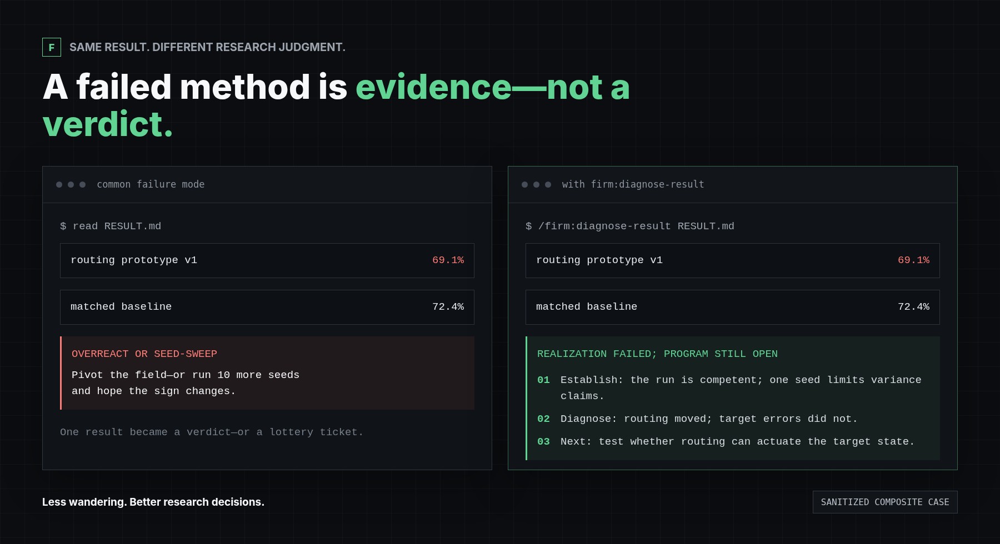
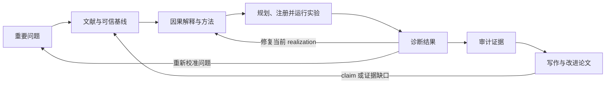

<p align="center">
  <strong>FIRM</strong><br>
  <sub><strong>F</strong>ailure-<strong>I</strong>nformed <strong>R</strong>esearch for <strong>M</strong>achines</sub>
</p>

<h1 align="center">经过真实科研检验的端到端 CS Research Skills。</h1>

<p align="center">
  17 个 skills，覆盖问题发现、方法形成、实验、独立 second-PI 评审<br>
  和证据驱动的论文写作。
</p>

<p align="center">
  <a href="README.md"><strong>English</strong></a> ·
  <a href="#30-秒安装"><strong>安装</strong></a> ·
  <a href="#看见差异"><strong>看见差异</strong></a> ·
  <a href="#开发时间线"><strong>开发时间线</strong></a> ·
  <a href="#设计与文档"><strong>文档</strong></a>
</p>

<p align="center">
  
  
  
  <a href="LICENSE"></a>
</p>

---

## 核心定位

**FIRM** 的全称是 **Failure-Informed Research for Machines**。

AI Agent 很擅长制造“在推进”的感觉：搜索、代码、实验、图表和草稿。真正困难的是科研
判断。FIRM 帮助 Agent 判断什么值得研究、一个结果究竟意味着什么、下一版该构造什么，
以及证据何时真正足以支撑一篇论文。

一个持续运行的 `research` skill 负责维护这条科学主线，覆盖文献、代码、实验、解释、
方法演化和论文决策；其余 16 个 specialists 只在其能力真正有用时进入。

端到端不等于静默消耗算力，也不等于按固定阶段一路推进。高影响操作仍然必须显式调用；
新证据可以让项目回到问题、基线或方法，而不是被流程强行推向论文。

## 看见差异

<p align="center">
  
</p>

面对同一个方法失败结果，没有 FIRM 的 Agent 可能直接关闭整个方向；FIRM 会把它转化为
对当前 realization 的构造性诊断。这个案例来自可运行的 [`demo/fixture`](demo/fixture)：
一次可信负结果可以否定当前实现，但不能据此杀死整个领域，也不能据此启动 seed sweep。
FIRM 保留有效证据，并选择真正能够改变设计判断的下一个实验。

```bash
make demo
```

该命令播放引导式终端故事板，不把预写内容伪装成模型评测。要用 Claude Code 运行中性
案例：

```bash
cd demo/fixture
claude
# 然后调用：/firm:diagnose-result RESULT.md
```

## 目录

- [核心定位](#核心定位)
- [看见差异](#看见差异)
- [工作原理](#工作原理)
- [30 秒安装](#30-秒安装)
- [启动自己的端到端科研项目](#启动自己的端到端科研项目)
- [FIRM 能做什么](#firm-能做什么)
- [从任意节点进入](#从任意节点进入)
- [FIRM 解决的不是“不会做”，而是“判断错”](#firm-解决的不是不会做而是判断错)
- [17 个 skills](#17-个-skills)
- [开发时间线](#开发时间线)
- [仓库结构](#仓库结构)
- [设计与文档](#设计与文档)

## 工作原理

```text
Prize -> Fidelity -> Design -> Evidence -> Entry
  ^                  新证据可以修改任何更早的判断                  |
  +---------------------------------------------------------------+
```

- **Prize：** 即使最理想结果成立，它对社区是否真正重要？
- **Fidelity：** 任务、基线、scorer、provenance 和成本是否可信？
- **Design：** 哪个 load-bearing method primitive 真正从证据中推出？
- **Evidence：** 这次运行诊断了什么，哪些解释和方法仍然存活？
- **Entry：** 当前贡献是否成熟到可以进入完整论文写作？

在关键边界，FIRM 默认使用一个全新的 Claude context 作为独立 second PI；如果已有其他
独立模型，例如 Codex，也可以增加一轮评审。Second PI 用来重新解释证据、发明替代方案
和攻击最强 claim，而不是充当停止按钮；评审工具不可用也不会暂停主研究者的工作。

### 实际科研循环



这是一个持续更新的科研循环，不是强制阶段机。同一个研究者始终维护原始研究计划、当前
论文、发现切片、方法谱系、scope debt、活动任务和下一步动作之间的一致性。

## 30 秒安装

在 Claude Code 中执行：

```text
/plugin marketplace add Zarien-Li/FIRM
/plugin install firm@firm-research
/reload-plugins
```

安装后所有命令都位于 `/firm:` 命名空间，不会与其他插件的 skills 冲突。

要在当前仓库中快速体验：

```text
/firm:research "作为持续的一作接管这个项目：保留重要问题，建立可信基线，构造并检验方法，解释每一个结果，只在证据成熟时进入论文。"
```

`research` 是持续研究负责人，不是一次性串行运行全部 17 个 skills 的宏。它先读取当前
项目状态，选择一个最高价值动作，再只加载解决当前不确定性所需的 specialist。

## 启动自己的端到端科研项目

对于长期严肃科研项目，推荐使用项目级安装，让 Research Program、首轮 Prompt 和 skills
跟随研究仓库一起保存。

### 1. 只需克隆一次 FIRM

```bash
git clone https://github.com/Zarien-Li/FIRM.git ~/FIRM
```

### 2. 初始化科研仓库

```bash
mkdir my-research-project
cd my-research-project
~/FIRM/firm init .
~/FIRM/firm doctor .
```

初始化器会保留已有 `CLAUDE.md`，并创建：

```text
my-research-project/
├── CLAUDE.md
├── .claude/skills/            # 17 个项目级 FIRM skills
└── .firm/
    ├── RESEARCH_PROGRAM.md
    ├── FIRST_MESSAGE_NEW.md
    └── FIRST_MESSAGE_AUDIT.md
```

### 3. 定义 Research Program Seed

填写 [`.firm/RESEARCH_PROGRAM.md`](templates/RESEARCH_PROGRAM.md)，在重要领域和价值
表面层面说明：

- 哪个结果真正有价值，谁会因此改变科学、工程或运营决策；
- 公认 benchmark、真实工作流、SOTA 和强基线；
- 价值指标、副作用、成本和安全指标；
- 算力、模型、数据与时间边界；
- 当前实验表面能够和不能够证明什么。

不要预先指定最终失败或方法。Seed 打开的是一个重要研究计划，具体问题和设计由后续证据
决定。

### 4. 启动持续一作会话

```bash
claude --append-system-prompt-file ~/FIRM/CLAUDE-RESEARCH.md
```

新研究计划可以直接使用
[`.firm/FIRST_MESSAGE_NEW.md`](templates/FIRST_MESSAGE_NEW.md)，或者调用：

```text
/research "从 .firm/RESEARCH_PROGRAM.md 开始，建立最强的经验接触点，并执行当前最高价值的可逆动作。"
```

已有项目使用
[`.firm/FIRST_MESSAGE_AUDIT.md`](templates/FIRST_MESSAGE_AUDIT.md)，先重建原始计划、
证据、方法谱系、scope debt、活动任务、论文成熟度和一个下一步动作，再启动更多工作。

也可以随时输出两类 Prompt：

```bash
~/FIRM/firm prompt new
~/FIRM/firm prompt audit
```

### 5. 沿着证据继续推进

持续研究者负责推进文献、基线、方法构造、实验、结果诊断和论文决策，同时维护一个紧凑
项目状态。具有副作用的工作流仍然必须显式调用，因此 FIRM 不会静默消耗算力、检查远程
任务或重写论文。

## FIRM 能做什么

| Discover | Build | Finish |
|---|---|---|
| 复现强基线，检查自然成功、失败和矛盾案例 | 把负结果转化为构造性方法谱系，而不是过早关闭方向或随机扩 seeds | 用独立 second PI 审计 Prize、Fidelity、证据、范围和论文成熟度 |
| 在项目演化中持续保留原始研究计划和社区价值 | 区分实现、设计、优化、统计和迁移不确定性 | 让最终 claim 与控制实验、成本、局限、引用和原始产物保持一致 |

一个持续研究者负责整个研究计划。Specialist skills 是按需加载的工具，不是刚性阶段机。

## 从任意节点进入

FIRM 可以从一个新方向、已有仓库、完成的结果、活动实验或论文草稿开始：

| 当前情况 | 直接入口 |
|---|---|
| 选择一个重要且可进入的研究领域 | `/firm:discover-direction [领域或约束]` |
| 启动或恢复完整研究计划 | `/firm:research [目标或项目状态]` |
| 建立领域标准的可信基线 | `/firm:baseline [任务或 benchmark]` |
| 解释负面、混合或意外结果 | `/firm:diagnose-result [结果路径]` |
| 发明或修复方法 primitive | `/firm:design-method [证据或失效组件]` |
| 选择最能改变判断的实验 | `/firm:plan-experiments [方法、claim、预算]` |
| 启动一个已注册的实验 | `/firm:register-experiment`，然后 `/firm:run-experiment` |
| 独立攻击一个关键科研决策 | `/firm:second-pi [决策或证据包]` |
| 审计论文入口并生成稿件 | `/firm:audit-research`，然后 `/firm:write-paper [论文目录]` |

多数判断型 skills 可以在相关时自动进入。七个高影响 skills 被设为**必须显式调用**：
`run-experiment`、
`monitor-experiment`、`write-paper`、`improve-paper`、`make-figures`、
`audit-experiment` 和 `audit-citations`。Claude 不会因为描述刚好匹配，就自动
消耗算力、检查远程系统、重写论文或执行提交前的产物审计。

## FIRM 解决的不是“不会做”，而是“判断错”

| 常见科研 Agent 失败 | FIRM 的处理方式 |
|---|---|
| 方法 v1 失败，于是宣布整个方向无效 | 在 run / realization / primitive / family 四个层级上校准结论 |
| 一个负结果后立刻扩十个 seeds | 先区分设计不确定性和统计不确定性 |
| 一个项目私有的小切片逐渐变成论文全部价值 | 分开维护原始研究计划、当前论文、发现切片和 scope debt |
| 方法失败后倒推包装成 analysis paper | 要求分析对象本身具有独立价值，而不是失败历史的副产品 |
| 每次都给用户十个下一步选项 | 按信息增益和研究价值选择一个最高价值动作 |
| 草稿越来越完整，反过来绑架后续实验 | 从原始结果、匹配基线和真实范围重建 claim |

FIRM 不是刚性阶段机。一个持续研究者负责整个研究计划，specialist skills 只在其能力
真正有用时进入。

### 三个核心思想

**失败层级。** 一次可信的负结果可以否定当前 realization，但不能自动否定 primitive、
方法家族或整个研究计划。

**构造性方法谱系。** 每一版方法都记录 causal bet、实际激活了什么、哪里失败、什么仍然
成立，以及下一版必须改变什么。

**论文与研究计划分离。** 原始研究计划、当前论文、发现切片和 scope debt 是四个不同
对象。一个狭窄结果不能只靠宽泛领域名称借来重要性。

## 17 个 skills

- **研究入口：** `research`、`discover-direction`、`literature-review`、`baseline`
- **诊断与方法：** `diagnose-result`、`design-method`、`plan-experiments`、`second-pi`
- **实验与审计：** `register-experiment`、`run-experiment`、`monitor-experiment`、`audit-experiment`、`audit-research`
- **论文阶段：** `write-paper`、`improve-paper`、`audit-citations`、`make-figures`

完整触发边界和组合方式见 [skills index](skills/INDEX.md)。

## 开发时间线

FIRM 不是一次写完后发布的 prompt pack。下面每次主要修订都来自真实研究中反复出现的
Agent 失败模式。

| 时间 | 发生了什么 | 产品变化 |
|---|---|---|
| 2025 Q1 | 长期运行的 Agent 能执行工作，却反复把普通科研决策退回给用户 | FIRM 开始尝试让 AI Agent 承担持续一作式所有权 |
| 2025 Q2 | 会话连续性保留了文件，却没有保留一个研究方向为何重要 | 增加持久 Research Program、value spine、反面证据和一个选定的下一步动作 |
| 2025 H2 | ARIS 展示了持久执行、可移植 skills 和多 Agent 评审的有效基础 | 采用部分执行思想，并通过真实使用重建科研决策层 |
| 2026 Q1 | 一个 realization 失败会关闭整个方法家族，坏设计又会触发浪费性的 seed expansion | 区分 run、realization、primitive 和 family failure，把构造性重设计设为默认 |
| 2026 Q2 | 宽泛研究计划不断收缩成私有小切片，失败方法被重新包装成 analysis paper | 增加 scope debt、标准任务重新接入、positive-object test 和独立 paper entry |
| 2026-06 | 在连续版本下开发的三篇经人工核验论文进入外部评审 | 9 份 ACL ARR 官方评审给出的 mean overall assessment 分别为 3.50、3.33 和 3.17 |
| 2026-07-27 | 五个模型家族累计超过 100B model tokens，暴露出重复 Agent 失败与工作流重叠 | 将系统收敛为一个持续研究者和 17 个聚焦 skills |

为了保护仍处于双盲流程中的工作，这里只公开聚合评审分数。它们不是录用决定，也不是
FIRM 因果效果的受控估计。所有计入的论文都经过人类作者阅读、核验和批准后才投稿。

## 仓库结构

```text
FIRM/
├── .claude-plugin/   # Claude Code 插件与 marketplace 清单
├── skills/           # 17 个可调用科研 skills 及其局部 references
├── templates/        # 可选的项目级科研初始化模板
├── examples/         # 脱敏后的科研 Agent 失败案例
├── demo/             # 中性结果诊断 fixture 与演示脚本
├── docs/             # 架构、失败地图、入门和发布文档
├── scripts/          # 校验、onboarding 和 release checks
├── assets/           # README 与社交预览素材
├── firm              # 项目级 init、doctor、list 和 prompt 工具
└── install.sh        # 全局或项目级直接安装脚本
```

每个公开能力位于 `skills/<name>/SKILL.md`。详细流程和 schema 放在所属 skill 的
`references/` 中，避免把无关说明同时加载进运行上下文。

## 设计与文档

- [入门指南](docs/getting-started.md)
- [Skills 索引与触发边界](skills/INDEX.md)
- [科研 Agent 失败地图](docs/failure-map.md)
- [三个脱敏案例](examples/README.md)
- [设计来源与演化](docs/origin-and-design.md)
- [Agent 与维护者指南](docs/agent-guide.md)
- [贡献指南](CONTRIBUTING.md)

## License

MIT。FIRM 不能替代研究者对创新性、数据、算力、作者署名、引用、披露、claim 和最终投稿
决定的责任。
